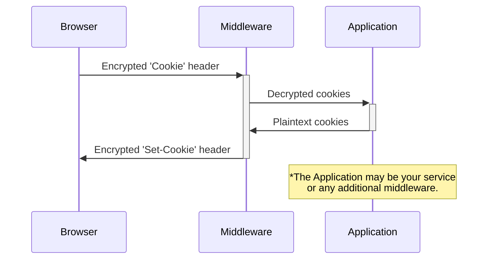

# starlette-securecookies


[](https://ecologi.com/eliasgabriel?r=6128126916bfab8bd051026c)

Customizable middleware for adding automatic cookie encryption and decryption to Starlette applications.

Tested support on Python 3.7, 3.8, 3.9, and 3.10, 3.11 on macOS, Windows, and Linux.

## How it works?



For any incoming cookies:

1. Requests sent from the client's browser to your application are intercepted by `SecureCookiesMiddleware`.
2. All `Cookie` headers are parsed and filter. Only cookies in the `included_cookies` and `excluded_cookies` parameters are parsed. All cookies are included by default.
3. The cookies are decrypted. If cookie cannot be decrypted, or is otherwise invalid, it is discarded by default (`discard_invalid=True`).
4. Any included and valid encrypted cookies in the ASGI request scope are replaced by the decrypted ones.
5. The request scope is passed to any future middleware, and eventually your application. Cookies can be read normally anywhere downstream.

For any outgoing cookies:

7. Your application sets cookies with `response.set_cookie` as usual.
8. Other middleware run and add additional cookies, like [SessionMiddleware](https://www.starlette.io/middleware/#sessionmiddleware).
9. All responses returned by your application are intercepted by `SecureCookiesMiddleware`.
10. Cookies in the `included_cookies` and `excluded_cookies` parameters are re-encrypted, and their attributes (like `"SameSite"` and `"HttpOnly"`) are overridden by the parameters set in `SecureCookiesMiddleware` if set.
11. The cookies in the response are replaced by the re-encrypted cookies, and the response is eventually propagated to the client's browser.

## Installation

```sh
$ pdm add starlette-securecookies
# or
$ python -m pip install --user starlette-securecookies
```

## Usage

This is a Starlette-based middleware, so it can be used in any Starlette application or Starlette-based framework (like [FastAPI](https://fastapi.tiangolo.com/advanced/middleware/)).

For example,

```python
from starlette.applications import Starlette
from starlette.middleware import Middleware

from securecookies import SecureCookiesMiddleware

middleware = [
    Middleware(
        SecureCookiesMiddleware, secrets=["SUPER SECRET SECRET"],
        # your other middleware
    )
]

app = Starlette(routes=..., middleware=middleware)
```

Note that if you're using another middleware that injects cookies into the response (such as [SessionMiddleware](https://www.starlette.io/middleware/#sessionmiddleware)), you have to make sure `SecureCookiesMiddleware` executes _after_ it so the cookie is present at encryption-time. Counter intuitively, in practice this means ensuring `SecureCookiesMiddleware` is _first_ in the list of middleware.

### Extras

`starlette-securecookies` provides some extras that introduce or patch secure cookie functionality into existing tools. They all reside in the `securecookies.extras` module. Currently there is only one, but more are welcome by recommendation or Pull Request!

- **`csrf.SecureCSRFMiddleware`**: Adds compatibility to the CSRF middleware provided by [starlette_csrf](https://github.com/frankie567/starlette-csrf). To use it, simply add it to your list of middleware (keep in mind the ordering). If you don't want to specify `starlette_csrf` as a direct dependency, you can also install it through the `[csrf]` package extra.

## License

This software is licensed under the [BSD 3-Clause License](LICENSE).

This package is Treeware. If you use it in production, consider buying the world a tree to thank me for my work. By contributing to my forest, you’ll be creating employment for local families and restoring wildlife habitats.
